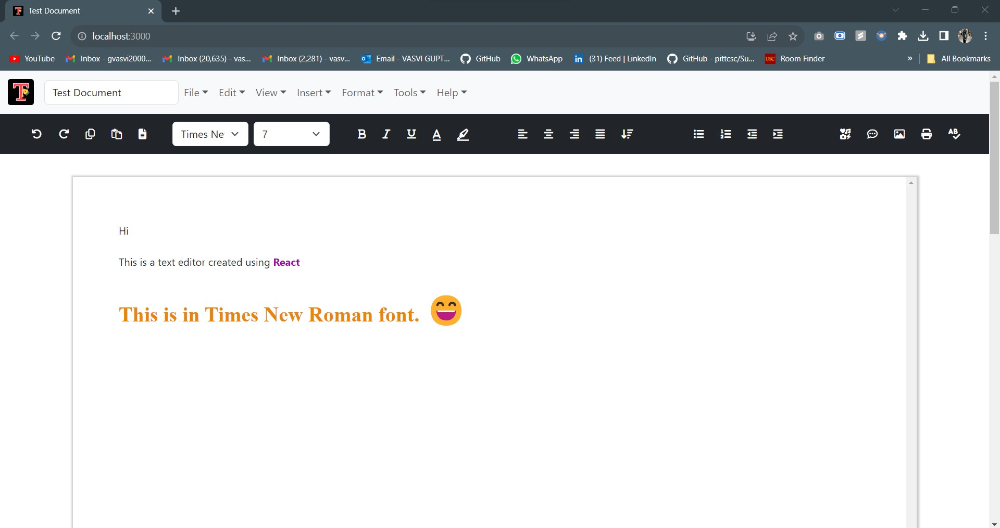

# Text Editor using React
This is a text editor which I built to learn ReactJS. It allows users to add/edit text, add images, undo/redo, spell and grammar check, and save and print document.

## Run on your machine

- Clone the repository
- Go inside the project directory
- Run `npm install` to install packages
- Run `npm start` to start the app. This runs the app in the development mode
- Open [http://localhost:3000](http://localhost:3000) to view it in your browser.

## Try the deployed version
[`Deployment Link`](https://vasvi1203.github.io/Text-Editor/)

